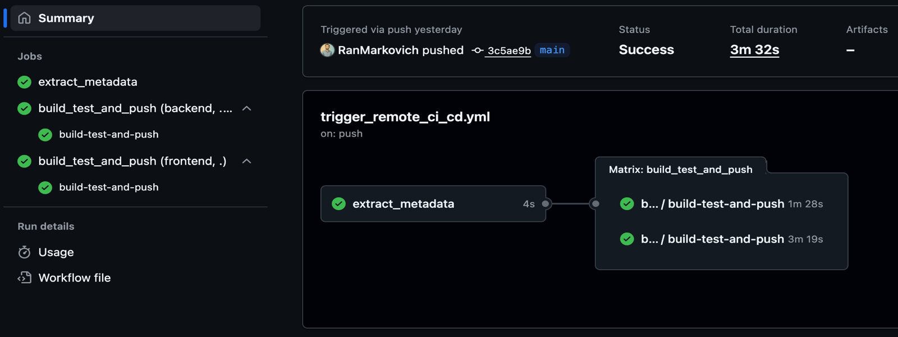
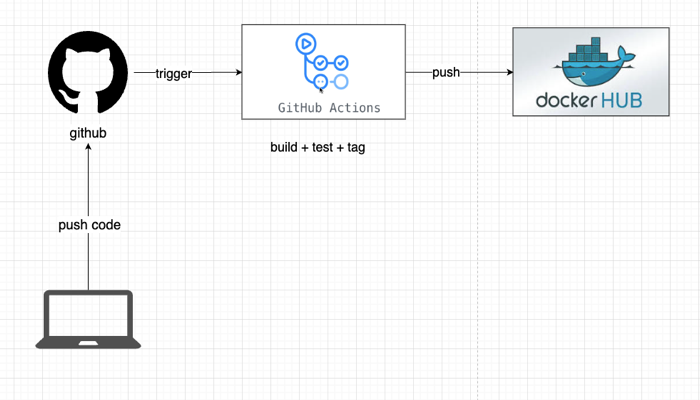

# CI-CD-Labs: Reusable GitHub Actions Workflows

This repository contains reusable GitHub Actions workflows designed to streamline CI/CD processes across multiple projects.

## Overview

The primary workflow in this repository is a **reusable backend CI/CD pipeline** that can be called from other repositories to build, test, and deploy backend applications using Docker.

## Workflows

### 🔄 Backend CI/CD Pipeline (`backend-ci-cd.yml`)

A comprehensive reusable workflow that handles the complete CI/CD lifecycle for backend applications.

#### Features

- **Docker Build & Test**: Builds Docker images with caching optimization
- **Health Check Testing**: Automatically tests the built container with health endpoints
- **Docker Registry Push**: Pushes successful builds to Docker Hub
- **Concurrent-Safe**: Includes proper cleanup and error handling

#### Required Inputs

| Input | Type | Description |
|-------|------|-------------|
| `tags` | string | Docker image tags (newline-separated) |
| `labels` | string | Docker image labels (newline-separated) |

#### Required Secrets

| Secret | Description |
|--------|-------------|
| `DOCKER_USERNAME` | Docker Hub username |
| `DOCKER_PASSWORD` | Docker Hub password/token |

#### Workflow Steps

1. **Checkout**: Fetches source code from the calling repository
2. **Docker Setup**: Configures Docker Buildx for advanced builds
3. **Authentication**: Logs into Docker Hub registry
4. **Build**: Creates Docker image with GitHub Actions cache
5. **Test**: Runs container and performs health checks
6. **Push**: Publishes image to Docker Hub registry
7. **Cleanup**: Removes test containers and outputs results

## Usage Example

### Upstream Repository Integration

This workflow is designed to be called from external repositories. Here's how it's integrated:

**Repository**: [`RanMarkovich/DevOps-Playground`](https://github.com/RanMarkovich/DevOps-Playground)  
**Trigger File**: `.github/workflows/trigger_remote_ci_cd.yml`



### How It Works

1. **Trigger**: Every push to the DevOps-Playground repository triggers the workflow
2. **Metadata Extraction**: The upstream workflow generates Docker tags and labels based on:
   - Branch names
   - Semantic version tags
   - Git commit SHA
3. **Remote Workflow Call**: The metadata is passed to this reusable workflow
4. **CI/CD Execution**: This workflow builds, tests, and pushes the Docker image
5. **Concurrency Control**: Ensures only one build runs per branch/ref at a time
6. **Matrix**: Running Backend and Frontent workflows in a matrix fasihon - parallely and independantly 

### High Level Diagram of the Workflow


## Configuration

### Environment Variables

- `DOCKER_REGISTRY`: Set to `docker.io` (Docker Hub)
- `CONTEXT_PATH`: Set to `./backend` (build context)

### Health Check

The workflow expects a health endpoint at `/health` that returns HTTP 200 when the service is ready.

## Benefits of This Approach

### ✅ **Reusability**
- Single workflow definition used across multiple repositories
- Consistent CI/CD processes across projects
- Centralized maintenance and updates

### ✅ **Separation of Concerns**
- **Upstream repo**: Focuses on application code and triggering
- **CI-CD-Labs**: Handles complex CI/CD logic and infrastructure

### ✅ **Security**
- Secrets are passed explicitly and securely
- No hardcoded credentials in application repositories

### ✅ **Efficiency**
- Docker layer caching reduces build times
- Concurrent workflow execution with proper cleanup

## Getting Started

To use this reusable workflow in your repository:

1. **Add the workflow call** in your `.github/workflows/` directory
2. **Configure required secrets** in your repository settings:
   - `DOCKER_USERNAME`
   - `DOCKER_PASSWORD`
3. **Ensure your backend has** a `/health` endpoint
4. **Customize the Docker image name** and metadata as needed

## Repository Structure

```
CI-CD-Labs/
├── .github/
│   └── workflows/
│       └── backend-ci-cd.yml    # Main reusable workflow
└── README.md                    # This file
```

## Related Repositories

- **[DevOps-Playground](https://github.com/RanMarkovich/DevOps-Playground)**: Example implementation using this reusable workflow
- **Docker Hub**: [ranmarkovich/devops-backend-app](https://hub.docker.com/r/ranmarkovich/devops-backend-app)

---

*For questions or contributions, please open an issue or submit a pull request.* 